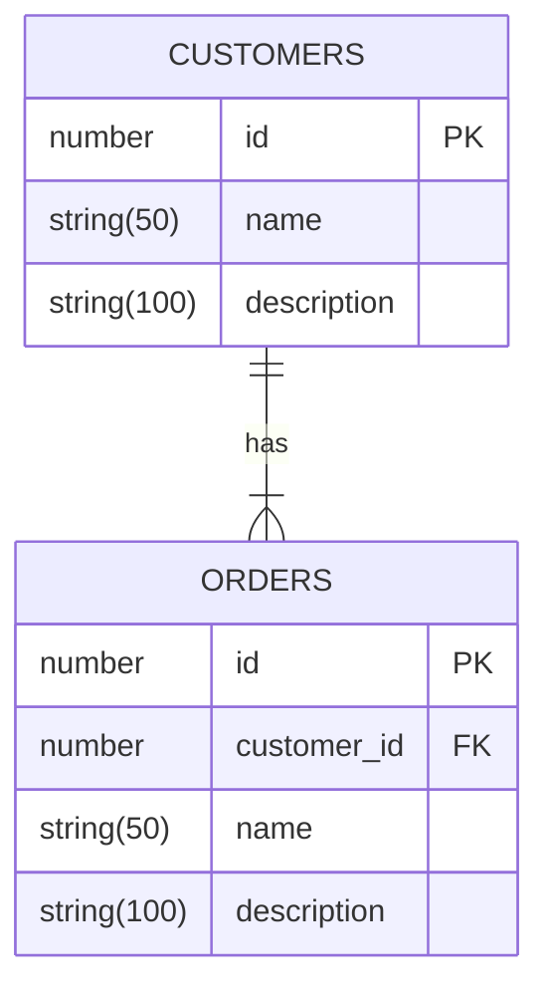

```mermaid
erDiagram
    CUSTOMERS {
        number id PK
        string(50) name
        string(100) description
    }

    ORDERS {
        number id PK
        number customer_id FK
        string(50) name
        string(100) description
    }
    CUSTOMERS ||--}| ORDERS : "has"
```